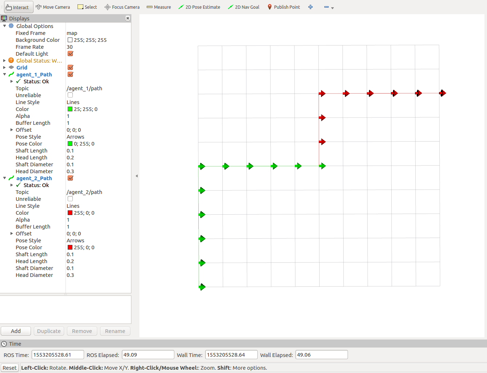

# vishnu_rudrasamudram_intern

Multi-agent scenario with decentralized planning

### Overview

This is a package to demonstrate multi-agent scenario with decentralized planning in a grid world.This is a package to demonstrate multi-agent scenario with decentralized planning in a grid world. The final result can be seen below,




### Installation
#### Building  

> Make sure that you have ROS installed and workspace is created

```git clone https://github.com/vvrs/vishnu_rudrasamudram_intern.git```  
```cd ~/catkin_ws```  
```catkin_make```

### Usage  
  
- Use 'add_agent.launch' to create a node for a new agent  

```roslaunch vishnu_rudrasamudram_intern add_agent.launch```

- Run 'plan_server_node' to get the path for a given agent  

```rosrun vishnu_rudrasamudram_intern plan_server_node```   

### Launch Files
##### add_agent.launch
Use this launch file to add new agent to the environment. When launching the new agent, make sure to provide `robot_id`. Otherwise, the new node kills the old node because of the name conflict. Use, x,y,theta to provide initial location. 

###### Arguments
* **robot_id** : Default `robot_0'
* **x** : Default `0`  
* **y** : Default `0`
* **theta** : Default `0`  

##### planner_and_viz.launch
This launches planner server node, and rviz node for visualization of the path.

### Nodes

#### agent_node

Publications: 
 * /agent_feedback [vishnu_rudrasamudram_intern/Position]
 * /agent_path [vishnu_rudrasamudram_intern/Path]

Subscriptions: None

Services: 
 * /update_goal


#### plan_server_node

Publications: None

Subscriptions: 
 * /agent_feedback [vishnu_rudrasamudram_intern/Position]

Services: 
 * /get_plan


#### paths2rviz_node
Publications: 
 * /path [nav_msgs/Path]

Subscriptions: 
 * /agent_path [vishnu_rudrasamudram_intern/Path]

Services: None

### Test

Run below commands in different terminal tabs


```roslaunch vishnu_rudrasamudram_intern add_agent.launch```

```roslaunch vishnu_rudrasamudram_intern add_agent.launch robot_id:=agent_2 x:=5 y:=5```

```roslaunch vishnu_rudrasamudram_intern planner_and_viz.launch```

Now, you will see two nodes for agents (agent_1_node and agent_2_node) run and RViz window opens.

Use below command to make a service call to update the goal

```
rosservice call /update_goal "goal:
  x: 5
  y: 5
  theta: 0.0
id:
  data: agent_1" 
 ``` 

```
rosservice call /update_goal "goal:
  x: 10
  y: 8
  theta: 0.0
id:
  data: agent_2" 
 ``` 

 Once the above command is executed, rviz plots the path corresponding to robot. Currently, rviz is configured to show paths of only two agents, namely robot_0 and robot_1. 
